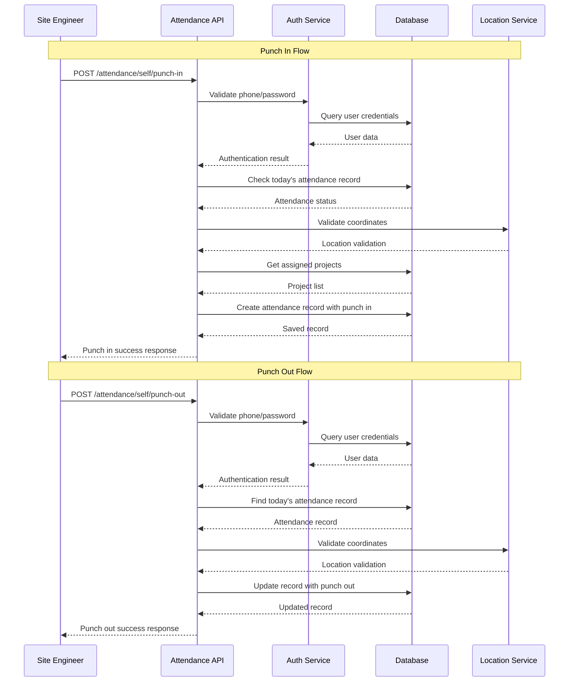
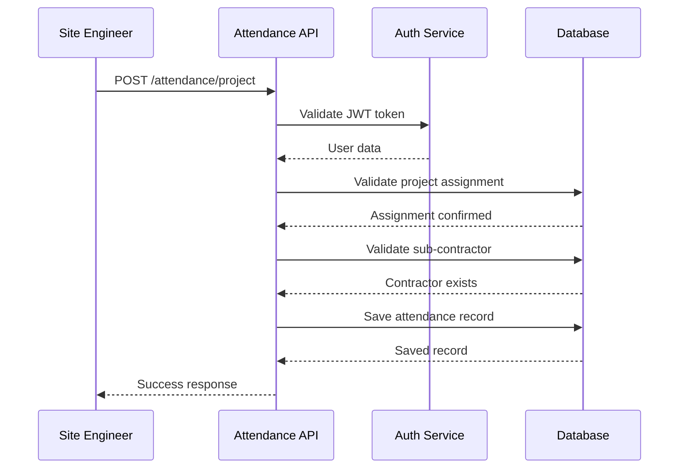

# Attendance Module Design

## 🏗️ High-Level Architecture

### Module Overview
The attendance module will have two main functionalities:
1. **Self Attendance** - Site Engineers mark their own attendance with location verification
2. **Project Attendance** - Site Engineers mark attendance for project workers/laborers

### Key Components
- **Database Models**: `SelfAttendance`, `ProjectAttendance` 
- **API Service**: `attendance_service.py`
- **Schemas**: `attendance_schemas.py`
- **Location Validation**: Enhanced location service
- **Authentication**: Leverages existing JWT-based auth

## 📊 Database Schema Design

### 1. Self Attendance Table
```sql
CREATE TABLE self_attendance (
    id SERIAL PRIMARY KEY,
    uuid UUID UNIQUE NOT NULL DEFAULT uuid_generate_v4(),
    user_id UUID NOT NULL REFERENCES users(uuid),
    attendance_date DATE NOT NULL,

    -- Punch In Details
    punch_in_time TIMESTAMP NOT NULL DEFAULT NOW(),
    punch_in_latitude DECIMAL(10, 8) NOT NULL,
    punch_in_longitude DECIMAL(11, 8) NOT NULL,
    punch_in_location_address TEXT,

    -- Punch Out Details (can be NULL if user forgets to punch out)
    punch_out_time TIMESTAMP NULL,
    punch_out_latitude DECIMAL(10, 8) NULL,
    punch_out_longitude DECIMAL(11, 8) NULL,
    punch_out_location_address TEXT,

    assigned_projects JSONB, -- Array of project UUIDs user was assigned to at time of punch in
    is_deleted BOOLEAN NOT NULL DEFAULT FALSE,
    created_at TIMESTAMP NOT NULL DEFAULT NOW(),

    CONSTRAINT unique_user_date UNIQUE(user_id, attendance_date, is_deleted)
);
```

### 2. Project Attendance Table
```sql
CREATE TABLE project_attendance (
    id SERIAL PRIMARY KEY,
    uuid UUID UNIQUE NOT NULL DEFAULT uuid_generate_v4(),
    site_engineer_id UUID NOT NULL REFERENCES users(uuid),
    project_id UUID NOT NULL REFERENCES projects(uuid),
    sub_contractor_id UUID NOT NULL REFERENCES person(uuid),
    no_of_labours INTEGER NOT NULL CHECK (no_of_labours > 0),
    attendance_date DATE NOT NULL,
    marked_at TIMESTAMP NOT NULL DEFAULT NOW(),
    latitude DECIMAL(10, 8) NOT NULL,
    longitude DECIMAL(11, 8) NOT NULL,
    location_address TEXT,
    notes TEXT,
    is_deleted BOOLEAN NOT NULL DEFAULT FALSE,
    created_at TIMESTAMP NOT NULL DEFAULT NOW()
);
```

### 3. Indexes for Performance
```sql
-- Self Attendance Indexes
CREATE INDEX idx_self_attendance_user_date ON self_attendance(user_id, attendance_date);
CREATE INDEX idx_self_attendance_date ON self_attendance(attendance_date);
CREATE INDEX idx_self_attendance_punch_in_location ON self_attendance(punch_in_latitude, punch_in_longitude);
CREATE INDEX idx_self_attendance_punch_times ON self_attendance(punch_in_time, punch_out_time);

-- Project Attendance Indexes
CREATE INDEX idx_project_attendance_project_date ON project_attendance(project_id, attendance_date);
CREATE INDEX idx_project_attendance_engineer_date ON project_attendance(site_engineer_id, attendance_date);
CREATE INDEX idx_project_attendance_contractor ON project_attendance(sub_contractor_id);
```

## 🔌 API Design

### Base URL: `/attendance`

### 1. Self Attendance APIs

#### Punch In (Mark Self Attendance)
```http
POST /attendance/self/punch-in
Authorization: Bearer <token>
Content-Type: application/json

{
    "phone": 9876543210,
    "password": "user_password",
    "latitude": 28.6139,
    "longitude": 77.2090,
    "location_address": "New Delhi, India" // Optional
}

Response:
{
    "data": {
        "uuid": "attendance-uuid",
        "attendance_date": "2024-01-15",
        "punch_in_time": "2024-01-15T09:30:00Z",
        "punch_in_location": {
            "latitude": 28.6139,
            "longitude": 77.2090,
            "address": "New Delhi, India"
        },
        "punch_out_time": null,
        "punch_out_location": null,
        "assigned_projects": [
            {
                "uuid": "project-uuid-1",
                "name": "Project Alpha"
            }
        ]
    },
    "message": "Punch in successful",
    "status_code": 201
}
```

#### Punch Out
```http
POST /attendance/self/punch-out
Authorization: Bearer <token>
Content-Type: application/json

{
    "phone": 9876543210,
    "password": "user_password",
    "latitude": 28.6139,
    "longitude": 77.2090,
    "location_address": "New Delhi, India" // Optional
}

Response:
{
    "data": {
        "uuid": "attendance-uuid",
        "attendance_date": "2024-01-15",
        "punch_in_time": "2024-01-15T09:30:00Z",
        "punch_in_location": {
            "latitude": 28.6139,
            "longitude": 77.2090,
            "address": "New Delhi, India"
        },
        "punch_out_time": "2024-01-15T18:30:00Z",
        "punch_out_location": {
            "latitude": 28.6140,
            "longitude": 77.2091,
            "address": "New Delhi, India"
        },
        "total_hours": "9.0",
        "assigned_projects": [
            {
                "uuid": "project-uuid-1",
                "name": "Project Alpha"
            }
        ]
    },
    "message": "Punch out successful",
    "status_code": 200
}
```

#### Get Current Attendance Status
```http
GET /attendance/self/status
Authorization: Bearer <token>

Response:
{
    "data": {
        "uuid": "attendance-uuid",
        "attendance_date": "2024-01-15",
        "is_punched_in": true,
        "punch_in_time": "2024-01-15T09:30:00Z",
        "punch_out_time": null,
        "current_hours": "2.5"
    },
    "message": "Current attendance status retrieved successfully",
    "status_code": 200
}
```

#### Get Self Attendance History
```http
GET /attendance/self/history?start_date=2024-01-01&end_date=2024-01-31&page=1&limit=10
Authorization: Bearer <token>

Response:
{
    "data": {
        "attendances": [
            {
                "uuid": "attendance-uuid",
                "attendance_date": "2024-01-15",
                "punch_in_time": "2024-01-15T09:30:00Z",
                "punch_out_time": "2024-01-15T18:30:00Z",
                "total_hours": "9.0",
                "punch_in_location": {...},
                "punch_out_location": {...}
            }
        ],
        "total_count": 25,
        "page": 1,
        "limit": 10
    },
    "message": "Self attendance history retrieved successfully",
    "status_code": 200
}
```

### 2. Project Attendance APIs

#### Mark Project Attendance
```http
POST /attendance/project
Authorization: Bearer <token>
Content-Type: application/json

{
    "project_id": "project-uuid",
    "sub_contractor_id": "person-uuid",
    "no_of_labours": 15,
    "latitude": 28.6139,
    "longitude": 77.2090,
    "location_address": "Project Site, New Delhi", // Optional
    "notes": "Morning shift attendance" // Optional
}

Response:
{
    "data": {
        "uuid": "attendance-uuid",
        "project": {
            "uuid": "project-uuid",
            "name": "Project Alpha"
        },
        "sub_contractor": {
            "uuid": "person-uuid", 
            "name": "Contractor Name"
        },
        "no_of_labours": 15,
        "attendance_date": "2024-01-15",
        "marked_at": "2024-01-15T09:30:00Z",
        "location": {
            "latitude": 28.6139,
            "longitude": 77.2090,
            "address": "Project Site, New Delhi"
        }
    },
    "message": "Project attendance marked successfully",
    "status_code": 201
}
```

#### Get Project Attendance History
```http
GET /attendance/project/history?project_id=uuid&start_date=2024-01-01&end_date=2024-01-31
Authorization: Bearer <token>

Response:
{
    "data": {
        "attendances": [...],
        "total_count": 50,
        "summary": {
            "total_labour_days": 450,
            "unique_contractors": 5,
            "average_daily_labours": 15
        }
    },
    "message": "Project attendance history retrieved successfully", 
    "status_code": 200
}
```

### 3. Reporting APIs

#### Daily Attendance Summary
```http
GET /attendance/reports/daily?date=2024-01-15&project_id=uuid
Authorization: Bearer <token>

Response:
{
    "data": {
        "date": "2024-01-15",
        "project": {...},
        "self_attendances": 8,
        "project_attendances": 12,
        "total_labours": 180,
        "contractors": [...]
    },
    "message": "Daily attendance summary retrieved successfully",
    "status_code": 200
}
```

## 🔒 Security & Validation

### Authentication Flow for Self Attendance
1. User provides phone + password in request body
2. System validates credentials against database
3. System verifies the authenticated user matches the JWT token user
4. Location coordinates are validated for reasonableness
5. Duplicate attendance for same date is prevented

### Authorization Rules
- **Site Engineers**: Can mark self attendance and project attendance for assigned projects
- **Project Managers**: Can view attendance for their projects
- **Admins/Super Admins**: Can view all attendance data
- **Sub Contractors**: Cannot access attendance APIs

### Location Validation
- Latitude: -90 to 90 degrees
- Longitude: -180 to 180 degrees
- Optional reverse geocoding for address validation

## 📱 Business Logic

### Self Attendance Rules
1. One attendance record per user per day
2. Must provide valid phone/password combination for both punch in and punch out
3. Location coordinates are mandatory for both punch in and punch out
4. System captures assigned projects at time of punch in
5. Punch in and punch out must be for the current day only (no future or past dates)
6. Must punch in before punching out (for the same day only)
7. Cannot punch out without punching in first (for the same day only)
8. If user forgets to punch out, punch_out_time remains NULL
9. User can punch in the next day even if they forgot to punch out the previous day
10. Multiple punch in/out cycles allowed on the same day (user can punch out and punch in again)

### Project Attendance Rules
1. Site Engineer must be assigned to the project
2. Sub Contractor must exist in system
3. Number of labours must be positive integer
4. Multiple entries allowed per project per day (different contractors)
5. Project attendance can only be marked for the current day

## 🔄 Integration Points

### Existing System Integration
- **User Authentication**: Leverages existing JWT auth system
- **Project Assignment**: Uses existing ProjectUserMap relationships
- **Person Management**: Integrates with existing Person model for sub-contractors
- **Location Service**: Extends existing LocationService for validation
- **Logging**: Uses existing logging infrastructure
- **Database**: Follows existing SQLAlchemy patterns

### Future Enhancements
- **Geofencing**: Validate attendance location against project boundaries
- **Photo Verification**: Add photo capture for attendance verification
- **Biometric Integration**: Fingerprint/face recognition for enhanced security
- **Offline Support**: Allow offline attendance marking with sync
- **Push Notifications**: Attendance reminders and confirmations
- **Analytics Dashboard**: Advanced reporting and insights

## 📊 Data Flow Diagrams

### Self Attendance Flow (Punch In/Out)


### Project Attendance Flow


## 📋 Implementation Checklist

### Phase 1: Core Implementation
- [ ] Create database models (`SelfAttendance`, `ProjectAttendance`)
- [ ] Create Pydantic schemas for API requests/responses
- [ ] Implement attendance service with business logic
- [ ] Create API endpoints for marking attendance
- [ ] Add location validation functionality
- [ ] Implement basic authentication and authorization

### Phase 2: Enhanced Features
- [ ] Add attendance history and reporting APIs
- [ ] Implement pagination for large datasets
- [ ] Add attendance summary and analytics
- [ ] Create admin panel integration
- [ ] Add comprehensive error handling and logging

### Phase 3: Advanced Features
- [ ] Implement geofencing for location validation
- [ ] Add photo verification capabilities
- [ ] Create mobile app integration
- [ ] Add push notification system
- [ ] Implement offline attendance sync

## 🧪 Testing Strategy

### Unit Tests
- Database model validation
- Business logic functions
- Location validation algorithms
- Authentication and authorization

### Integration Tests
- API endpoint functionality
- Database operations
- External service integrations
- End-to-end attendance workflows

### Performance Tests
- Large dataset handling
- Concurrent attendance marking
- Database query optimization
- API response times

## 📈 Monitoring & Analytics

### Key Metrics
- Daily attendance rates
- Location accuracy
- API response times
- Error rates and types
- User engagement patterns

### Logging Requirements
- All attendance marking events
- Authentication attempts
- Location validation results
- Error conditions and exceptions
- Performance metrics

---

**Note**: This design follows the existing codebase patterns and provides a robust foundation for the attendance module. The implementation should be done incrementally, starting with core functionality and gradually adding enhanced features.
