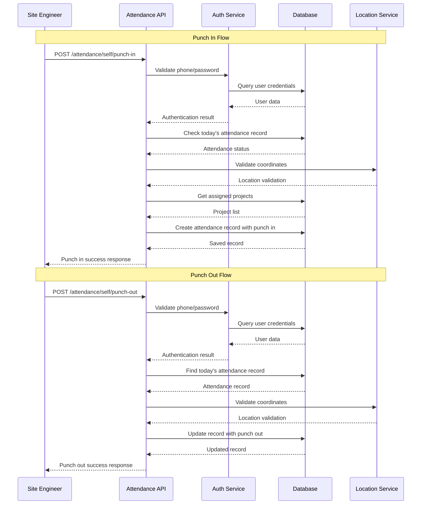
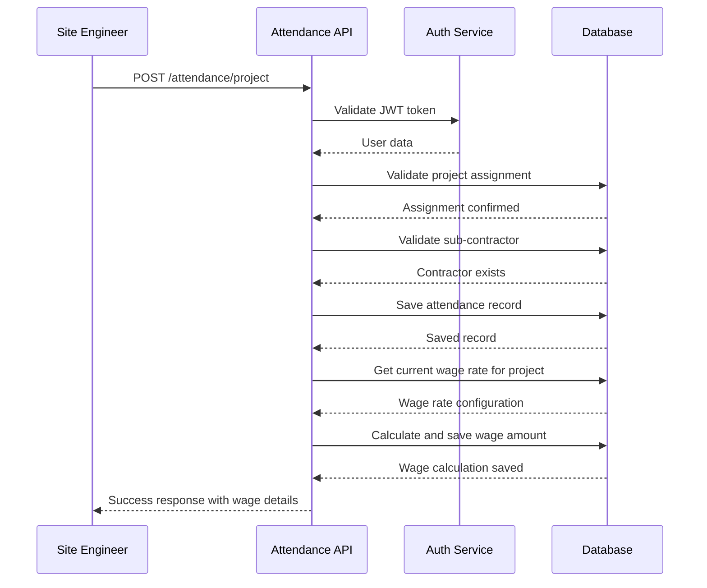

# Attendance Module Design

## 🏗️ High-Level Architecture

### Module Overview
The attendance module will have two main functionalities:
1. **Self Attendance** - Site Engineers mark their own attendance with location verification
2. **Project Attendance** - Site Engineers mark attendance for project workers/laborers

### Key Components
- **Database Models**: `SelfAttendance`, `ProjectAttendance`, `ProjectDailyWage`, `ProjectAttendanceWage`
- **API Service**: `attendance_service.py`, `wage_service.py`
- **Schemas**: `attendance_schemas.py`, `wage_schemas.py`
- **Location Validation**: Enhanced location service
- **Wage Management**: Automatic wage calculation and configuration system
- **Authentication**: Leverages existing JWT-based auth

## 📊 Database Schema Design

### 1. Self Attendance Table
```sql
CREATE TABLE self_attendance (
    id SERIAL PRIMARY KEY,
    uuid UUID UNIQUE NOT NULL DEFAULT uuid_generate_v4(),
    user_id UUID NOT NULL REFERENCES users(uuid),
    attendance_date DATE NOT NULL,

    -- Punch In Details
    punch_in_time TIMESTAMP NOT NULL DEFAULT NOW(),
    punch_in_latitude DECIMAL(10, 8) NOT NULL,
    punch_in_longitude DECIMAL(11, 8) NOT NULL,
    punch_in_location_address TEXT,

    -- Punch Out Details (can be NULL if user forgets to punch out)
    punch_out_time TIMESTAMP NULL,
    punch_out_latitude DECIMAL(10, 8) NULL,
    punch_out_longitude DECIMAL(11, 8) NULL,
    punch_out_location_address TEXT,

    assigned_projects JSONB, -- Array of project UUIDs user was assigned to at time of punch in
    is_deleted BOOLEAN NOT NULL DEFAULT FALSE,
    created_at TIMESTAMP NOT NULL DEFAULT NOW(),

    CONSTRAINT unique_user_date UNIQUE(user_id, attendance_date, is_deleted)
);
```

### 2. Project Attendance Table
```sql
CREATE TABLE project_attendance (
    id SERIAL PRIMARY KEY,
    uuid UUID UNIQUE NOT NULL DEFAULT uuid_generate_v4(),
    site_engineer_id UUID NOT NULL REFERENCES users(uuid),
    project_id UUID NOT NULL REFERENCES projects(uuid),
    sub_contractor_id UUID NOT NULL REFERENCES person(uuid),
    no_of_labours INTEGER NOT NULL CHECK (no_of_labours > 0),
    attendance_date DATE NOT NULL,
    marked_at TIMESTAMP NOT NULL DEFAULT NOW(),
    latitude DECIMAL(10, 8) NOT NULL,
    longitude DECIMAL(11, 8) NOT NULL,
    location_address TEXT,
    notes TEXT,
    is_deleted BOOLEAN NOT NULL DEFAULT FALSE,
    created_at TIMESTAMP NOT NULL DEFAULT NOW()
);
```

### 3. Project Daily Wage Configuration Table
```sql
CREATE TABLE project_daily_wage (
    id SERIAL PRIMARY KEY,
    uuid UUID UNIQUE NOT NULL DEFAULT uuid_generate_v4(),
    project_id UUID NOT NULL REFERENCES projects(uuid),
    daily_wage_rate DECIMAL(10, 2) NOT NULL CHECK (daily_wage_rate > 0),
    effective_date DATE NOT NULL,
    configured_by_user_id UUID NOT NULL REFERENCES users(uuid),
    is_deleted BOOLEAN NOT NULL DEFAULT FALSE,
    created_at TIMESTAMP NOT NULL DEFAULT NOW(),

    -- Ensure only one active wage rate per project per date
    CONSTRAINT unique_project_effective_date UNIQUE(project_id, effective_date, is_deleted)
);
```

### 4. Project Attendance Wage Calculation Table
```sql
CREATE TABLE project_attendance_wage (
    id SERIAL PRIMARY KEY,
    uuid UUID UNIQUE NOT NULL DEFAULT uuid_generate_v4(),
    project_attendance_id UUID NOT NULL REFERENCES project_attendance(uuid),
    project_daily_wage_id UUID NOT NULL REFERENCES project_daily_wage(uuid),
    no_of_labours INTEGER NOT NULL,
    daily_wage_rate DECIMAL(10, 2) NOT NULL,
    total_wage_amount DECIMAL(12, 2) NOT NULL, -- no_of_labours * daily_wage_rate
    calculated_at TIMESTAMP NOT NULL DEFAULT NOW(),
    is_deleted BOOLEAN NOT NULL DEFAULT FALSE,
    created_at TIMESTAMP NOT NULL DEFAULT NOW(),

    -- One wage calculation per attendance record
    CONSTRAINT unique_attendance_wage UNIQUE(project_attendance_id, is_deleted)
);
```

### 5. Indexes for Performance
```sql
-- Self Attendance Indexes
CREATE INDEX idx_self_attendance_user_date ON self_attendance(user_id, attendance_date);
CREATE INDEX idx_self_attendance_date ON self_attendance(attendance_date);
CREATE INDEX idx_self_attendance_punch_in_location ON self_attendance(punch_in_latitude, punch_in_longitude);
CREATE INDEX idx_self_attendance_punch_times ON self_attendance(punch_in_time, punch_out_time);

-- Project Attendance Indexes
CREATE INDEX idx_project_attendance_project_date ON project_attendance(project_id, attendance_date);
CREATE INDEX idx_project_attendance_engineer_date ON project_attendance(site_engineer_id, attendance_date);
CREATE INDEX idx_project_attendance_contractor ON project_attendance(sub_contractor_id);

-- Project Daily Wage Indexes
CREATE INDEX idx_project_daily_wage_project ON project_daily_wage(project_id);
CREATE INDEX idx_project_daily_wage_effective_date ON project_daily_wage(effective_date);
CREATE INDEX idx_project_daily_wage_project_date ON project_daily_wage(project_id, effective_date);

-- Project Attendance Wage Indexes
CREATE INDEX idx_project_attendance_wage_attendance ON project_attendance_wage(project_attendance_id);
CREATE INDEX idx_project_attendance_wage_daily_wage ON project_attendance_wage(project_daily_wage_id);
CREATE INDEX idx_project_attendance_wage_calculated_at ON project_attendance_wage(calculated_at);
```

## 🔌 API Design

### Base URL: `/attendance`

### 1. Self Attendance APIs

#### Punch In (Mark Self Attendance)
```http
POST /attendance/self/punch-in
Authorization: Bearer <token>
Content-Type: application/json

{
    "phone": 9876543210,
    "password": "user_password",
    "latitude": 28.6139,
    "longitude": 77.2090,
    "location_address": "New Delhi, India" // Optional
}

Response:
{
    "data": {
        "uuid": "attendance-uuid",
        "attendance_date": "2024-01-15",
        "punch_in_time": "2024-01-15T09:30:00Z",
        "punch_in_location": {
            "latitude": 28.6139,
            "longitude": 77.2090,
            "address": "New Delhi, India"
        },
        "punch_out_time": null,
        "punch_out_location": null,
        "assigned_projects": [
            {
                "uuid": "project-uuid-1",
                "name": "Project Alpha"
            }
        ]
    },
    "message": "Punch in successful",
    "status_code": 201
}
```

#### Punch Out
```http
POST /attendance/self/punch-out
Authorization: Bearer <token>
Content-Type: application/json

{
    "phone": 9876543210,
    "password": "user_password",
    "latitude": 28.6139,
    "longitude": 77.2090,
    "location_address": "New Delhi, India" // Optional
}

Response:
{
    "data": {
        "uuid": "attendance-uuid",
        "attendance_date": "2024-01-15",
        "punch_in_time": "2024-01-15T09:30:00Z",
        "punch_in_location": {
            "latitude": 28.6139,
            "longitude": 77.2090,
            "address": "New Delhi, India"
        },
        "punch_out_time": "2024-01-15T18:30:00Z",
        "punch_out_location": {
            "latitude": 28.6140,
            "longitude": 77.2091,
            "address": "New Delhi, India"
        },
        "total_hours": "9.0",
        "assigned_projects": [
            {
                "uuid": "project-uuid-1",
                "name": "Project Alpha"
            }
        ]
    },
    "message": "Punch out successful",
    "status_code": 200
}
```

#### Get Current Attendance Status
```http
GET /attendance/self/status
Authorization: Bearer <token>

Response:
{
    "data": {
        "uuid": "attendance-uuid",
        "attendance_date": "2024-01-15",
        "is_punched_in": true,
        "punch_in_time": "2024-01-15T09:30:00Z",
        "punch_out_time": null,
        "current_hours": "2.5"
    },
    "message": "Current attendance status retrieved successfully",
    "status_code": 200
}
```

#### Get Self Attendance History
```http
GET /attendance/self/history?start_date=2024-01-01&end_date=2024-01-31&page=1&limit=10
Authorization: Bearer <token>

Response:
{
    "data": {
        "attendances": [
            {
                "uuid": "attendance-uuid",
                "attendance_date": "2024-01-15",
                "punch_in_time": "2024-01-15T09:30:00Z",
                "punch_out_time": "2024-01-15T18:30:00Z",
                "total_hours": "9.0",
                "punch_in_location": {...},
                "punch_out_location": {...}
            }
        ],
        "total_count": 25,
        "page": 1,
        "limit": 10
    },
    "message": "Self attendance history retrieved successfully",
    "status_code": 200
}
```

### 2. Project Attendance APIs

#### Mark Project Attendance (Updated with Wage Calculation)
```http
POST /attendance/project
Authorization: Bearer <token>
Content-Type: application/json

{
    "project_id": "project-uuid",
    "sub_contractor_id": "person-uuid",
    "no_of_labours": 15,
    "latitude": 28.6139,
    "longitude": 77.2090,
    "location_address": "Project Site, New Delhi", // Optional
    "notes": "Morning shift attendance" // Optional
}

Response:
{
    "data": {
        "uuid": "attendance-uuid",
        "project": {
            "uuid": "project-uuid",
            "name": "Project Alpha"
        },
        "sub_contractor": {
            "uuid": "person-uuid",
            "name": "Contractor Name"
        },
        "no_of_labours": 15,
        "attendance_date": "2024-01-15",
        "marked_at": "2024-01-15T09:30:00Z",
        "location": {
            "latitude": 28.6139,
            "longitude": 77.2090,
            "address": "Project Site, New Delhi"
        },
        "wage_calculation": {
            "uuid": "wage-calc-uuid",
            "daily_wage_rate": 300.00,
            "total_wage_amount": 4500.00,
            "wage_config_effective_date": "2024-01-10"
        }
    },
    "message": "Project attendance marked successfully with wage calculation",
    "status_code": 201
}
```

#### Get Project Attendance History
```http
GET /attendance/project/history?project_id=uuid&start_date=2024-01-01&end_date=2024-01-31
Authorization: Bearer <token>

Response:
{
    "data": {
        "attendances": [...],
        "total_count": 50,
        "summary": {
            "total_labour_days": 450,
            "unique_contractors": 5,
            "average_daily_labours": 15
        }
    },
    "message": "Project attendance history retrieved successfully", 
    "status_code": 200
}
```

### 3. Daily Wage Management APIs

#### Configure Daily Wage Rate
```http
POST /projects/{project_id}/daily-wage
Authorization: Bearer <token>
Content-Type: application/json

{
    "daily_wage_rate": 350.00,
    "effective_date": "2024-01-15" // Optional, defaults to current date
}

Response:
{
    "data": {
        "uuid": "wage-config-uuid",
        "project_id": "project-uuid",
        "daily_wage_rate": 350.00,
        "effective_date": "2024-01-15",
        "configured_by": {
            "uuid": "user-uuid",
            "name": "Admin User",
            "role": "Admin"
        }
    },
    "message": "Daily wage rate configured successfully",
    "status_code": 201
}
```

#### Get Current Active Wage Rate
```http
GET /projects/{project_id}/daily-wage
Authorization: Bearer <token>

Response:
{
    "data": {
        "uuid": "wage-config-uuid",
        "project_id": "project-uuid",
        "daily_wage_rate": 350.00,
        "effective_date": "2024-01-15",
        "configured_by": {
            "uuid": "user-uuid",
            "name": "Admin User",
            "role": "Admin"
        }
    },
    "message": "Current wage rate retrieved successfully",
    "status_code": 200
}
```

#### Get Wage Rate History
```http
GET /projects/{project_id}/daily-wage/history?page=1&limit=10
Authorization: Bearer <token>

Response:
{
    "data": {
        "wage_rates": [
            {
                "uuid": "wage-config-uuid-2",
                "daily_wage_rate": 350.00,
                "effective_date": "2024-01-15",
                "configured_by": {...}
            },
            {
                "uuid": "wage-config-uuid-1",
                "daily_wage_rate": 300.00,
                "effective_date": "2024-01-01",
                "configured_by": {...}
            }
        ],
        "total_count": 2,
        "page": 1,
        "limit": 10
    },
    "message": "Wage rate history retrieved successfully",
    "status_code": 200
}
```

#### Update Wage Rate
```http
PUT /projects/{project_id}/daily-wage/{wage_id}
Authorization: Bearer <token>
Content-Type: application/json

{
    "daily_wage_rate": 375.00,
    "effective_date": "2024-01-20"
}

Response:
{
    "data": {
        "uuid": "wage-config-uuid",
        "project_id": "project-uuid",
        "daily_wage_rate": 375.00,
        "effective_date": "2024-01-20",
        "configured_by": {...}
    },
    "message": "Wage rate updated successfully",
    "status_code": 200
}
```

#### Delete Wage Rate (Soft Delete)
```http
DELETE /projects/{project_id}/daily-wage/{wage_id}
Authorization: Bearer <token>

Response:
{
    "data": null,
    "message": "Wage rate deleted successfully",
    "status_code": 200
}
```

### 4. Wage Calculation & Reporting APIs

#### Get Project Wage Summary
```http
GET /projects/{project_id}/wage-summary?start_date=2024-01-01&end_date=2024-01-31&page=1&limit=10
Authorization: Bearer <token>

Response:
{
    "data": {
        "wage_calculations": [
            {
                "attendance": {
                    "uuid": "attendance-uuid",
                    "attendance_date": "2024-01-15",
                    "marked_at": "2024-01-15T09:30:00Z",
                    "no_of_labours": 15,
                    "site_engineer": {
                        "uuid": "user-uuid",
                        "name": "Engineer Name",
                        "role": "SiteEngineer"
                    },
                    "sub_contractor": {
                        "uuid": "person-uuid",
                        "name": "Contractor Name"
                    }
                },
                "wage_calculation": {
                    "uuid": "wage-calc-uuid",
                    "daily_wage_rate": 350.00,
                    "total_wage_amount": 5250.00,
                    "calculated_at": "2024-01-15T09:30:00Z"
                },
                "wage_configuration": {
                    "uuid": "wage-config-uuid",
                    "effective_date": "2024-01-15",
                    "configured_by": {
                        "uuid": "admin-uuid",
                        "name": "Admin User",
                        "role": "Admin"
                    },
                    "configured_at": "2024-01-14T10:00:00Z"
                }
            }
        ],
        "summary": {
            "total_wage_amount": 52500.00,
            "total_labour_days": 150,
            "average_daily_wage": 350.00,
            "unique_contractors": 5
        },
        "total_count": 25,
        "page": 1,
        "limit": 10
    },
    "message": "Project wage summary retrieved successfully",
    "status_code": 200
}
```

#### Get Comprehensive Wage History
```http
GET /projects/{project_id}/wage-history?start_date=2024-01-01&end_date=2024-01-31
Authorization: Bearer <token>

Response:
{
    "data": {
        "wage_history": [...], // Similar to wage-summary but with more detailed breakdown
        "rate_changes": [
            {
                "effective_date": "2024-01-15",
                "old_rate": 300.00,
                "new_rate": 350.00,
                "configured_by": {...}
            }
        ],
        "monthly_summary": {
            "total_amount": 105000.00,
            "total_labour_days": 300,
            "rate_change_impact": 15000.00
        }
    },
    "message": "Comprehensive wage history retrieved successfully",
    "status_code": 200
}
```

#### Get Wage Details for Specific Attendance
```http
GET /attendance/project/{attendance_id}/wage-details
Authorization: Bearer <token>

Response:
{
    "data": {
        "attendance": {...},
        "wage_calculation": {
            "uuid": "wage-calc-uuid",
            "daily_wage_rate": 350.00,
            "no_of_labours": 15,
            "total_wage_amount": 5250.00,
            "calculated_at": "2024-01-15T09:30:00Z"
        },
        "wage_configuration": {
            "uuid": "wage-config-uuid",
            "effective_date": "2024-01-15",
            "configured_by": {...},
            "configured_at": "2024-01-14T10:00:00Z"
        }
    },
    "message": "Wage details retrieved successfully",
    "status_code": 200
}
```

### 5. Reporting APIs

#### Daily Attendance Summary (Updated with Wage Data)
```http
GET /attendance/reports/daily?date=2024-01-15&project_id=uuid
Authorization: Bearer <token>

Response:
{
    "data": {
        "date": "2024-01-15",
        "project": {...},
        "self_attendances": 8,
        "project_attendances": 12,
        "total_labours": 180,
        "total_wage_amount": 63000.00,
        "current_daily_wage_rate": 350.00,
        "contractors": [...]
    },
    "message": "Daily attendance summary retrieved successfully",
    "status_code": 200
}
```

## 🔒 Security & Validation

### Authentication Flow for Self Attendance
1. User provides phone + password in request body
2. System validates credentials against database
3. System verifies the authenticated user matches the JWT token user
4. Location coordinates are validated for reasonableness
5. Duplicate attendance for same date is prevented

### Authorization Rules
- **Site Engineers**: Can mark self attendance and project attendance for assigned projects
- **Project Managers**: Can view attendance for their projects, configure wage rates for their projects
- **Admins/Super Admins**: Can view all attendance data, configure wage rates for all projects
- **Sub Contractors**: Cannot access attendance APIs
- **Wage Configuration**: Only Admin, Project Manager, and Super Admin roles can configure daily wage rates

### Location Validation
- Latitude: -90 to 90 degrees
- Longitude: -180 to 180 degrees
- Optional reverse geocoding for address validation

## 📱 Business Logic

### Self Attendance Rules
1. One attendance record per user per day
2. Must provide valid phone/password combination for both punch in and punch out
3. Location coordinates are mandatory for both punch in and punch out
4. System captures assigned projects at time of punch in
5. Punch in and punch out must be for the current day only (no future or past dates)
6. Must punch in before punching out (for the same day only)
7. Cannot punch out without punching in first (for the same day only)
8. If user forgets to punch out, punch_out_time remains NULL
9. User can punch in the next day even if they forgot to punch out the previous day
10. Multiple punch in/out cycles allowed on the same day (user can punch out and punch in again)

### Project Attendance Rules
1. Site Engineer must be assigned to the project
2. Sub Contractor must exist in system
3. Number of labours must be positive integer
4. Multiple entries allowed per project per day (different contractors)
5. Project attendance can only be marked for the current day
6. Wage calculation is automatically performed when attendance is marked
7. Uses the most recent active wage rate at the time of attendance marking

### Daily Wage Management Rules
1. Only Admin, Project Manager, and Super Admin can configure wage rates
2. Wage rates are effective from the date they are created/updated
3. Historical wage calculations remain unchanged when new rates are added
4. Each project can have multiple wage rate configurations with different effective dates
5. System uses the most recent wage rate that is effective on or before the attendance date
6. Wage rate must be a positive decimal value
7. Effective date cannot be in the future
8. Soft delete functionality preserves audit trail

## 🔄 Integration Points

### Existing System Integration
- **User Authentication**: Leverages existing JWT auth system
- **Project Assignment**: Uses existing ProjectUserMap relationships
- **Person Management**: Integrates with existing Person model for sub-contractors
- **Location Service**: Extends existing LocationService for validation
- **Logging**: Uses existing logging infrastructure
- **Database**: Follows existing SQLAlchemy patterns
- **Role-based Access**: Integrates with existing UserRole enum for wage configuration permissions
- **Audit Trail**: Uses existing user tracking patterns for wage configuration history

### Future Enhancements
- **Geofencing**: Validate attendance location against project boundaries
- **Photo Verification**: Add photo capture for attendance verification
- **Biometric Integration**: Fingerprint/face recognition for enhanced security
- **Offline Support**: Allow offline attendance marking with sync
- **Push Notifications**: Attendance reminders and confirmations
- **Analytics Dashboard**: Advanced reporting and insights
- **Wage Rate Templates**: Pre-configured wage rate templates for different project types
- **Overtime Calculation**: Support for overtime wage calculations
- **Bonus/Incentive Management**: Additional wage components beyond daily rates
- **Wage Payment Integration**: Connect with payment processing systems
- **Multi-currency Support**: Support for different currencies in wage calculations

## 📊 Data Flow Diagrams

### Self Attendance Flow (Punch In/Out)


### Project Attendance Flow


## 📋 Implementation Checklist

### Phase 1: Core Implementation
- [ ] Create database models (`SelfAttendance`, `ProjectAttendance`, `ProjectDailyWage`, `ProjectAttendanceWage`)
- [ ] Create Pydantic schemas for API requests/responses (attendance and wage management)
- [ ] Implement attendance service with business logic
- [ ] Implement wage service with automatic calculation logic
- [ ] Create API endpoints for marking attendance
- [ ] Create API endpoints for wage configuration (CRUD operations)
- [ ] Add location validation functionality
- [ ] Implement basic authentication and authorization
- [ ] Add automatic wage calculation on attendance marking

### Phase 2: Enhanced Features
- [ ] Add attendance history and reporting APIs
- [ ] Implement comprehensive wage reporting and summary APIs
- [ ] Implement pagination for large datasets
- [ ] Add attendance and wage summary analytics
- [ ] Create admin panel integration for wage management
- [ ] Add comprehensive error handling and logging
- [ ] Implement wage rate history tracking
- [ ] Add audit trail for wage configurations

### Phase 3: Advanced Features
- [ ] Implement geofencing for location validation
- [ ] Add photo verification capabilities
- [ ] Create mobile app integration
- [ ] Add push notification system
- [ ] Implement offline attendance sync
- [ ] Add wage rate templates and bulk operations
- [ ] Implement overtime and bonus calculations
- [ ] Add wage payment integration capabilities

## 🧪 Testing Strategy

### Unit Tests
- Database model validation (attendance and wage models)
- Business logic functions (attendance and wage calculation)
- Location validation algorithms
- Authentication and authorization
- Wage calculation algorithms
- Wage rate effective date logic

### Integration Tests
- API endpoint functionality (attendance and wage management)
- Database operations (attendance and wage data)
- External service integrations
- End-to-end attendance workflows
- Wage calculation integration with attendance marking
- Wage configuration and retrieval workflows

### Performance Tests
- Large dataset handling (attendance and wage data)
- Concurrent attendance marking with wage calculations
- Database query optimization (complex wage reporting queries)
- API response times for wage summary reports
- Bulk wage calculation operations

## 📈 Monitoring & Analytics

### Key Metrics
- Daily attendance rates
- Location accuracy
- API response times
- Error rates and types
- User engagement patterns
- Wage calculation accuracy
- Wage configuration changes
- Total wage amounts calculated
- Average daily wage rates by project

### Logging Requirements
- All attendance marking events
- Authentication attempts
- Location validation results
- Error conditions and exceptions
- Performance metrics
- Wage configuration changes (create, update, delete)
- Wage calculation events
- Failed wage calculations
- Wage rate effective date changes
- Audit trail for all wage-related operations

## 💰 Wage Management Example Scenario

### Scenario: Project Daily Wage Evolution
```
Day 1 (Jan 1): Admin configures Project_Alpha daily wage = ₹300
Days 1-5: All attendance marked uses ₹300 rate
- Day 1: 10 laborers × ₹300 = ₹3,000
- Day 2: 15 laborers × ₹300 = ₹4,500
- Day 3: 12 laborers × ₹300 = ₹3,600

Day 6 (Jan 6): Project Manager updates Project_Alpha daily wage = ₹350
Days 6+: All new attendance uses ₹350 rate
- Day 6: 10 laborers × ₹350 = ₹3,500
- Day 7: 15 laborers × ₹350 = ₹5,250

Historical calculations (Days 1-5) remain unchanged at ₹300 rate
New calculations (Days 6+) use ₹350 rate
```

### Wage Calculation Logic
```python
def calculate_wage(project_id, attendance_date, no_of_labours):
    # Get the most recent wage rate effective on or before attendance_date
    wage_config = get_effective_wage_rate(project_id, attendance_date)
    total_amount = no_of_labours * wage_config.daily_wage_rate

    # Store calculation with reference to wage config used
    save_wage_calculation(
        attendance_id=attendance.uuid,
        wage_config_id=wage_config.uuid,
        no_of_labours=no_of_labours,
        daily_wage_rate=wage_config.daily_wage_rate,
        total_amount=total_amount
    )

    return total_amount
```

---

**Note**: This comprehensive design includes both attendance tracking and wage management features. The design follows existing codebase patterns and provides a robust foundation for the complete attendance module. Implementation should be done incrementally, starting with core attendance functionality, then adding wage management features.
